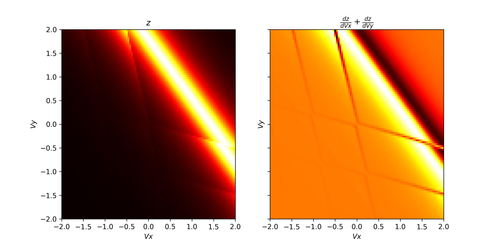
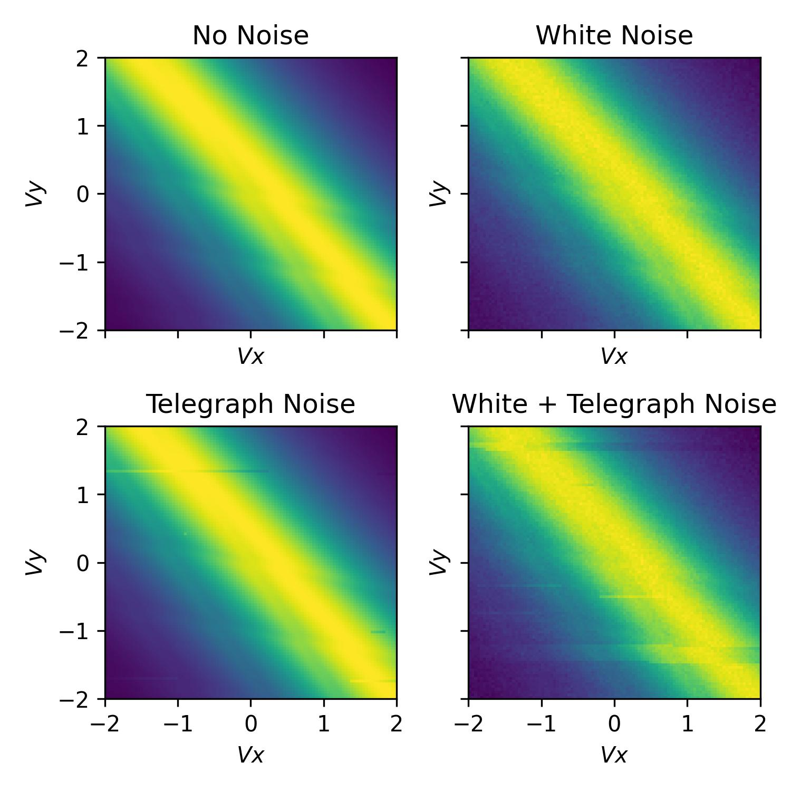
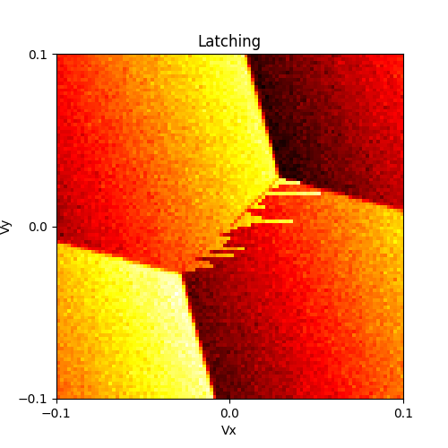

########
Advanced functionality
########

Here we will provide some examples which show off some of the more advanced functionally
provided by QArray.

+++++++++
Including noise in the simulation
+++++++++

To add noise to the simulation, we can import some of noise classes provided by QArray. In the example below we demonstrate the use of the :code:`WhiteNoise` and :code:`TelegraphNoise` classes.

The :code:`WhiteNoise` class adds white noise to the simulation, of a particular amplitude (std).
The :code:`TelegraphNoise` simulates a charge trap randomly switching near the charge sensor. The probabilities
of the trap switching between the two states are given by :code:`p01` and :code:`p10`.
The amplitude of the noise is given by :code:`amplitude`.

In addition, all our noise models overload the `+` operator,
so we can combine them to create more complex noise models.

.. code:: python

    from qarray import ChargeSensedDotArray, GateVoltageComposer
    from qarray.noise_models import WhiteNoise, TelegraphNoise, NoNoise

    # defining the capacitance matrices
    Cdd = [[0., 0.1], [0.1, 0.]]  # an (n_dot, n_dot) array of the capacitive coupling between dots
    Cgd = [[1., 0.2, 0.05], [0.2, 1., 0.05], ]  # an (n_dot, n_gate) array of the capacitive coupling between gates and dots
    Cds = [[0.02, 0.01]]  # an (n_sensor, n_dot) array of the capacitive coupling between dots and sensors
    Cgs = [[0.06, 0.05, 1]]  # an (n_sensor, n_gate) array of the capacitive coupling between gates and sensor dots

    # creating the model
    model = ChargeSensedDotArray(
        Cdd=Cdd, Cgd=Cgd, Cds=Cds, Cgs=Cgs,
        coulomb_peak_width=0.05, T=100
    )

    # defining a white noise model with an amplitude of 1e-2
    white_noise = WhiteNoise(amplitude=1e-2)

    # defining a telegraph noise model with p01 = 5e-4, p10 = 5e-3 and an amplitude of 1e-2
    random_telegraph_noise = TelegraphNoise(p01=5e-4, p10=5e-3, amplitude=1e-2)

    # combining the white and telegraph noise models
    combined_noise = white_noise + random_telegraph_noise

    # defining the noise models
    noise_models = [
        NoNoise(), # no noise
        white_noise, # white noise
        random_telegraph_noise, # telegraph noise
        combined_noise, # white + telegraph noise
    ]

    # plotting
    fig, axes = plt.subplots(2, 2, sharex=True, sharey=True)
    fig.set_size_inches(5, 5)

    for ax, noise_model in zip(axes.flatten(), noise_models):
        model.noise_model = noise_model

        # fixing the seed so subsequent runs are yield identical noise
        np.random.seed(0)
        z, n = model.charge_sensor_open(vg)

        ax.imshow(z, extent=[vx_min, vx_max, vy_min, vy_max], origin='lower', aspect='auto', cmap='hot')
        ax.set_xlabel('$Vx$')
        ax.set_ylabel('$Vy$')

    axes[0, 0].set_title('No Noise')
    axes[0, 1].set_title('White Noise')
    axes[1, 0].set_title('Telegraph Noise')
    axes[1, 1].set_title('White + Telegraph Noise')

    plt.tight_layout()

|charge_sensing_noise|

+++++++++
Latching
+++++++++

Within QArray we provide two latching models: :code:`LatchingModel` and :code:`PSBLatchingModel`. The :code:`LatchingModel` simulates latching on the transitions to the leads and inter-dot transitions, caused in reality by slow tunnel rates. The :code:`PSBLatchingModel` simulates latching only when the moving from (1, 1) to (0, 2) as indicative of Pauli spin blockade.
As in the real world, there is a polarity to this latching, based on the direction in the transition is crossed.
In this section, we demonstrate the use of the :code:`LatchingModel` with the :code:`ChargeSensedDotArray` class.

To begin, we import the necessary elements and define the capacitance matrices.
We then define the latching model and the charge sensed dot array model. The latching model class
takes three arguments:

- The number of dots in the device array.

- A vector, :code:`p_leads`, encoding information about the tunnel rate to the leads. The elements are such that if the voltage configuration crosses the (N, M) -> (N + 1, M) charge transition, :code:`p_leads[0]` is the probability that the dot's charge configuration will change from (N, M) to (N + 1, M) in the next pixel of the charge stability diagram. In our case we set both probabilities to `0.25`.

- A matrix, :code:`p_inter`, encoding information about the tunnel rates between dots. These elements are such that if the (N, M) -> (N - 1, M + 1) charge transition is crossed, :code:`p_inter[0][1]` is the probability that the dot's charge configuration will change from (N, M) to (N - 1, M + 1) in the next pixel of the charge stability diagram. Note that the unlatched case, the probability of this transition is `1`. The diagonal elements of the matrix are not used. In the example below we set the off-diagonals to 1, meaning no latching will occur on the inter-dot transition.

.. code:: python

    """
    An example demonstrating the use of the latching models
    """
    from matplotlib import pyplot as plt

    from qarray import ChargeSensedDotArray, GateVoltageComposer, WhiteNoise, LatchingModel

    # defining the capacitance matrices
    Cdd = [[0., 0.1], [0.1, 0.]]  # an (n_dot, n_dot) array of the capacitive coupling between dots
    Cgd = [[1., 0.2, 0.05], [0.2, 1., 0.05], ]  # an (n_dot, n_gate) array of the capacitive coupling between gates and dots
    Cds = [[0.02, 0.01]]  # an (n_sensor, n_dot) array of the capacitive coupling between dots and sensors
    Cgs = [[0.06, 0.02, 1]]  # an (n_sensor, n_gate) array of the capacitive coupling between gates and sensor dots

    # a latching model which simulates latching on the transitions to the leads and inter-dot transitions
    latching_model = LatchingModel(
        n_dots=2,
        p_leads=[0.25, 0.25],
        p_inter=[
            [0., 1.],
            [1., 0.],
        ]
    )

    # creating the model
    model = ChargeSensedDotArray(
        Cdd=Cdd, Cgd=Cgd, Cds=Cds, Cgs=Cgs,
        coulomb_peak_width=0.05, T=5,
        algorithm='default',
        implementation='rust',
        noise_model=WhiteNoise(amplitude=1e-3),
        latching_model=latching_model,
    )

Alternatively, we can use the Pauli spin blockade latching model via :code:`PSBLatchingModel`. This model only has one parameter, which is the probability of latching when moving from the (1, 1) to (0, 2) charge states as indicative of PSB.

.. code:: python

    # a latching model which simulates latching only when the moving from (1, 1) to (0, 2) as indicative of PSB
    latching_model = PSBLatchingModel(
        n_dots=2,
        p_psb=0.2
    )

With our array and latching models defined, we use the :code:`GateVoltageComposer` to create a gate voltage sweep and the :code:`optimal_Vg` method to find the optimal gate voltages in the same way as before. We plot the output of the charge sensor, shown below.

.. code:: python

    # creating the voltage composer
    voltage_composer = GateVoltageComposer(n_gate=model.n_gate)

    # defining the min and max values for the dot voltage sweep
    vx_min, vx_max = -0.1, 0.1
    vy_min, vy_max = -0.1, 0.1
    # using the dot voltage composer to create the dot voltage array for the 2d sweep
    vg = voltage_composer.do2d(0, vy_min, vx_max, 100, 1, vy_min, vy_max, 100)
    vg += model.optimal_Vg([0.5, 1.5, 0.7])

    # creating the figure and axes
    z, n = model.charge_sensor_open(vg)

    plt.imshow(z, extent=[vx_min, vx_max, vy_min, vy_max], origin='lower', aspect='auto', cmap='hot')
    plt.xlabel('Vx')
    plt.ylabel('Vy')
    plt.title('Latching')
    plt.show()

|latching|

