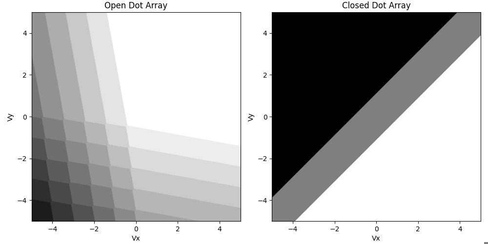

###############
Getting Started
###############

|structure|

+++++++++
Simulating charge stability diagrams
+++++++++

To get started with QArray all you need is two classes: The `DotArray` and the `GateVoltageComposer` class.

- The `DotArray` class stores the capacitance matrices that define your simulated system. It also provides the functionality to calculate the charge configuration of the quantum dot system with the lowest energy given a set of gate voltages.

- The `GateVoltageComposer` class generates the arrays of gate voltages necessary to perform 1D, 2D or higher scans of the quantum dot system. You can also pass it a virtual gate matrix, so that it can perform 1D, 2D or higher virtual gate scans of the quantum dot system.

Here we will be outlining how to use QArray to produce the stability diagram of a double quantum dot.

Firstly, we import the DotArray and GateComposer classes:

.. code:: python

    from qarray import DotArray, GateVoltageComposer

Upon initialising the DotArray class, we specify the system’s capacitance matrices:

.. code:: python

        model = DotArray(
            Cdd =[
                [0., 0.1],
                [0.1, 0.] ],
            Cgd =[
                [1., 0.2],
                [0.2, 1]],
        )

Here, :code:`Cdd` encodes the capacitive couplings between dots (the :code:`dd` subscript meaning dot-to-dot), and :code:`Cgd` encodes the capacitive couplings between the dots and the gates (:code:`dg` being dot-to-gate). These capacitance matrices can also be passed in their Maxwell format, using the keyword arguments :code:`cdd` and :code:`cgd`.

Next we initialise the GateVoltageComposer class, which will generate the gate voltage arrays necessary
to perform a scan of the quantum dot system. These arrays contain the simulated gate voltage for every gate in the system at each point in the measurement.

.. code:: python

        # initialising the gate voltage composer class
        voltage_composer = GateVoltageComposer(n_gates = model.n_gates))

        # using the dot voltage composer to create the dot voltage array for the 2d sweep
        vg = voltage_composer.do2d(
            x_gate = 0, x_min = -5, x_max = 5 , x_res = 100,
            y_gate = 0, y_min = -5, y_max = 5 , y_res = 100
        )

Now that we have the gate voltage arrays, we can calculate the charge configuration of the quantum dot system at each of these voltage configurations. We can do this for an open dot array (where the array is able freely exchange charge carriers with the reservoir) or a closed dot array (where the number of charge carriers is fixed).

.. code:: python

        # run the simulation in the open regime
        n_open = model.ground_state_open(vg)

        # run the simulation with the quantum dot array closed such that the
        # number of charge carriers is fixed to 2
        n_closed = model.ground_state_closed(vg, n_charges=2)

Here, :code:`n_open` is a (100, 100, 2) array encoding the number of charge carriers in each dot for each gate voltage configuration in the measurement. :code:`n_closed` is the same, but with the number of charge carriers in the system fixed to two.

With the calculations handled, we can now plot the output. We encode the change in output value due to a dot occupation change in the :code:`charge_state_contrast_array`.

.. code:: python

        charge_state_contrast_array = [0.8, 1.2]

        # creating arrays that encode when the dot occupation changes
        z_open = charge_state_contrast(n_open, charge_state_contrast_array)
        z_closed = charge_state_contrast(n_closed, charge_state_contrast_array)

        # plot the results
        fig, ax = plt.subplots(1, 2, figsize=(10, 5))
        ax[0].imshow(z_open.T, extent=(vx_min, vx_max, vy_min, vy_max), origin='lower', cmap='binary')
        ax[0].set_title('Open Dot Array')
        ax[0].set_xlabel('Vx')
        ax[0].set_ylabel('Vy')
        ax[1].imshow(z_closed.T, extent=(vx_min, vx_max, vy_min, vy_max), origin='lower', cmap='binary')
        ax[1].set_title('Closed Dot Array')
        ax[1].set_xlabel('Vx')
        ax[1].set_ylabel('Vy')
        plt.tight_layout()

|getting_started_example|

The `DotArray` class init has additional arguments that we left at their default values for the example above. For more control over your simulation, you may wish to use any of the following:

- `algorithm` : str : The algorithm used to calculate the ground state of the quantum dot system. The default is 'default', with the alternatives being 'brute_force' and 'thresholded'.
- `implementation` : str : The implementation used to calculate the ground state of the quantum dot system. The default is 'rust', with the alternatives being 'python' and 'jax' for GPU acceleration.
- `T` : float : The temperature of the system in kelvin to simulate thermal broadening. The default is 0.
- `charge_carrier`: str : The charge carrier used in the simulation. The default is 'hole', with the alternative being 'electron'.
- `threshold` : float : The threshold used in the thresholded algorithm (see Section III B 2 of `the paper <https://arxiv.org/pdf/2404.04994>`_).
- `max_charge_carriers`: int : The maximum number of charge carriers that can be on a dot, when using the brute_force algorithm.

+++++++++
Simulating charge sensing measurements
+++++++++

.. |structure| image:: ./figures/structure.png
