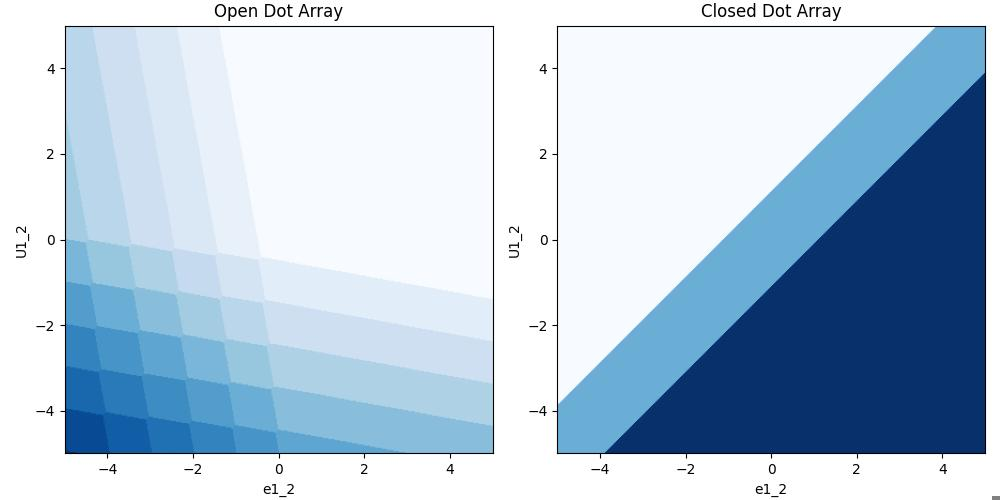
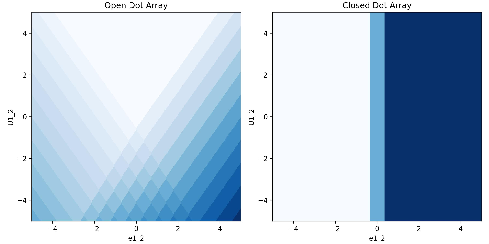

###############
Getting Started
###############

|structure|

+++++++++
Simulating charge stability diagrams
+++++++++

To get started with QArray all you need is two classes: The `DotArray` and the `GateVoltageComposer` class.

- The `DotArray` class stores the capacitance matrices that define your simulated system. It also provides the functionality to calculate the charge configuration of the quantum dot system with the lowest energy given a set of gate voltages.

- The `GateVoltageComposer` class generates the arrays of gate voltages necessary to perform 1D, 2D or higher scans of the quantum dot system. You can also pass it a virtual gate matrix, so that it can perform 1D, 2D or higher virtual gate scans of the quantum dot system.

Here we will be outlining how to use QArray to produce the stability diagram of a double quantum dot.

Firstly, we import the DotArray and GateComposer classes:

.. code:: python

    from qarray import DotArray, GateVoltageComposer

Upon initialising the DotArray class, we specify the system’s capacitance matrices:

.. code:: python

        model = DotArray(
            Cdd =[
                [0., 0.1],
                [0.1, 0.] ],
            Cgd =[
                [1., 0.2],
                [0.2, 1]],
        )

Here, :code:`Cdd` encodes the capacitive couplings between dots (the :code:`dd` subscript meaning dot-to-dot), and :code:`Cgd` encodes the capacitive couplings between the dots and the gates (:code:`dg` being dot-to-gate). These capacitance matrices can also be passed in their Maxwell format, using the keyword arguments :code:`cdd` and :code:`cgd`.

Next we initialise the GateVoltageComposer class, which will generate the gate voltage arrays necessary
to perform a scan of the quantum dot system. These arrays contain the simulated gate voltage for every gate in the system at each point in the measurement.

.. code:: python

        # initialising the gate voltage composer class
        voltage_composer = GateVoltageComposer(n_gates = model.n_gates))

        # using the dot voltage composer to create the dot voltage array for the 2d sweep
        vg = voltage_composer.do2d(
            x_gate = 'P1', x_min = -5, x_max = 5 , x_res = 100,
            y_gate = 'P2', y_min = -5, y_max = 5 , y_res = 100
        )
This scan sweeps the gate voltages of the quantum dot system from -5 to 5 in both the x and y directions, with 100 points in each direction. The :code:`do2d` method returns a (100, 100, 2) array encoding the gate voltage for each gate at each point in the measurement. To
sweep over the virtualised plunger gates simply use the arguments 'vP1' and 'vP2' instead of 'P1' and 'P2'. To sweep over the detuning and onsite energy
use the

Now that we have the gate voltage arrays, we can calculate the charge configuration of the quantum dot system at each of these voltage configurations. We can do this for an open dot array (where the array is able freely exchange charge carriers with the reservoir) or a closed dot array (where the number of charge carriers is fixed).

.. code:: python

        # run the simulation in the open regime
        n_open = model.ground_state_open(vg)

        # run the simulation with the quantum dot array closed such that the
        # number of charge carriers is fixed to 2
        n_closed = model.ground_state_closed(vg, n_charges=2)

Here, :code:`n_open` is a (100, 100, 2) array encoding the number of charge carriers in each dot for each gate voltage configuration in the measurement. :code:`n_closed` is the same, but with the number of charge carriers in the system fixed to two.

With the calculations handled, we can now plot the output. We encode the change in output value due to a dot occupation change in the :code:`charge_state_contrast_array`.

.. code:: python

    # importing a function which dots the charge occupation with the charge state contrast to yield a z value for plotting by imshow.
    from qarray import charge_state_contrast

    # plot the results
    fig, ax = plt.subplots(1, 2, figsize=(10, 5))
    ax[0].imshow(z_open, extent=(vx_min, vx_max, vy_min, vy_max), origin='lower', cmap='binary')
    ax[0].set_title('Open Dot Array')
    ax[0].set_xlabel('e1_2')
    ax[0].set_ylabel('U1_2')
    ax[1].imshow(z_closed, extent=(vx_min, vx_max, vy_min, vy_max), origin='lower', cmap='binary')
    ax[1].set_title('Closed Dot Array')
    ax[1].set_xlabel('e1_2')
    ax[1].set_ylabel('U1_2')

|getting_started_example_plunger_plunger|

However, we are not limted to just sweeping the plunger gates. We can sweep the virtualised plunger gates by charging the
arguments to 'vP1' and 'vP2'. We can also sweep the detuning and onsite energy by changing the arguments to 'e1_2' and 'U1_2' respectively.
This is shown below:

.. code:: python

    # using the dot voltage composer to create the dot voltage array for the 2d sweep
            vg = voltage_composer.do2d(
                x_gate = 'e1_2', x_min = -5, x_max = 5 , x_res = 100,
                y_gate = 'U1_2', y_min = -5, y_max = 5 , y_res = 100
            )

    # importing a function which dots the charge occupation with the charge state contrast to yield a z value for plotting by imshow.
    from qarray import charge_state_contrast

    charge_state_contrast_array = [0.8, 1.2]

    # creating arrays that encode when the dot occupation changes
    z_open = charge_state_contrast(n_open, charge_state_contrast_array)
    z_closed = charge_state_contrast(n_closed, charge_state_contrast_array)

    fig, ax = plt.subplots(1, 2, figsize=(10, 5))
    ax[0].imshow(z_open, extent=(vx_min, vx_max, vy_min, vy_max), origin='lower', cmap='binary')
    ax[0].set_title('Open Dot Array')
    ax[0].set_xlabel('e1_2')
    ax[0].set_ylabel('U1_2')
    ax[1].imshow(z_closed, extent=(vx_min, vx_max, vy_min, vy_max), origin='lower', cmap='binary')
    ax[1].set_title('Closed Dot Array')
    ax[1].set_xlabel('e1_2')
    ax[1].set_ylabel('U1_2')
    plt.tight_layout()

|getting_started_example_detuning_onsight|

The `DotArray` class init has additional arguments that we left at their default values for the example above. For more control over your simulation, you may wish to use any of the following:

- `algorithm` : str : The algorithm used to calculate the ground state of the quantum dot system. The default is 'default', with the alternatives being 'brute_force' and 'thresholded'.
- `implementation` : str : The implementation used to calculate the ground state of the quantum dot system. The default is 'rust', with the alternatives being 'python' and 'jax' for GPU acceleration.
- `T` : float : The temperature of the system in kelvin to simulate thermal broadening. The default is 0.
- `charge_carrier`: str : The charge carrier used in the simulation. The default is 'hole', with the alternative being 'electron'.
- `threshold` : float : The threshold used in the thresholded algorithm (see Section III B 2 of `the paper <https://arxiv.org/pdf/2404.04994>`_).
- `max_charge_carriers`: int : The maximum number of charge carriers that can be on a dot, when using the brute_force algorithm.

+++++++++
Charge sensing
+++++++++

To simulate a charge sensing measurement, we use the :code:`ChargeSensedDotArray` class. This class is functionally similar to the :code:`DotArray` class, but includes a quantum dot charge sensor coupled to the device array. We can control the strength of this coupling via the two additional matrices that it is necessary to include upon initialising the :code:`ChargeSensedDotArray` class. The first (:code:`Cds`) specifies the strength  of the coupling between the device array's dots and the charge sensor, and the second (:code:`Cgs`) specifies the strength of the coupling between the device array's gates and the charge sensor. The width of the Coulomb peak in the simulated charge sensing quantum dot is passed via the :code:`coulomb_peak_width` keyword argument.

The snippet below is an example of how we can use these classes to generate a charge-sensed measurement.

.. code:: python

    from qarray import ChargeSensedDotArray, GateVoltageComposer

    # defining the capacitance matrices
    Cdd = [[0., 0.1], [0.1, 0.]]  # an (n_dot, n_dot) array of the capacitive coupling between dots
    Cgd = [[1., 0.2, 0.05], [0.2, 1., 0.05], ]  # an (n_dot, n_gate) array of the capacitive coupling between gates and dots
    Cds = [[0.02, 0.01]]  # an (n_sensor, n_dot) array of the capacitive coupling between dots and sensors
    Cgs = [[0.06, 0.05, 1]]  # an (n_sensor, n_gate) array of the capacitive coupling between gates and sensor dots

    # creating the model
    model = ChargeSensedDotArray(
        Cdd=Cdd, Cgd=Cgd, Cds=Cds, Cgs=Cgs,
        coulomb_peak_width=0.05, T=100
    )

It is important to note that for the double dot there are now three gates,
one for each dot and one for the charge sensor. The index 0 corresponds to the first dot,
index 1 to the second dot and index 2 to the charge sensor. This is important when using the :code:`GateVoltageComposer` with the :code:`ChargeSensedDotArray`.

As before, we can use the :code:`GateVoltageComposer` to create a gate voltage sweep. However, this time we will use
an addition piece of functionality, provided by both the :code:`DotArray` and :code:`ChargeSensedDotArray` classes, which is the
:code:`optimal_Vg` method. This method returns the optimal gate voltages which minimise the free energy of a given charge state.
For example, if we have a charge state of `[1., 1., 1.]` (in the case of two array dots and one charge sensing dot), the `optimal_Vg` method will return the gate voltages that configure the simulated device to be in the middle of the [1, 1] charge state and directly on top of the first Coloumb peak in the charge sensor. If the user passes `[0.5, 0.5, 0.5]`, the
method will return the gate voltages corresponding to the middle of the [0, 1] - [1,0] interdot charge transition and exactly halfway between two Coulomb peaks in the charge sensing dot. This can be useful for centring your simulation on a specific charge transition or state, as demonstrated in the snippet below.

.. code:: python

    voltage_composer = GateVoltageComposer(model.n_gate)

    # defining the min and max values for the dot voltage sweep
    vx_min, vx_max = -5, 5
    vy_min, vy_max = -5, 5
    # using the dot voltage composer to create the dot voltage array for the 2d sweep
    vg = voltage_composer.do2d('P1', vy_min, vx_max, 200, 'P2', vy_min, vy_max, 200)

    # centering the voltage sweep on the [0, 1] - [1, 0] interdot charge transition on the side of a charge sensor coulomb peak
    vg += model.optimal_Vg([0.5, 0.5, 0.6])

    # calculating the output of the charge sensor and the charge state for each gate voltage
    z, n = model.charge_sensor_open(vg)
    dz_dV1 = np.gradient(z, axis=0) + np.gradient(z, axis=1)

We can plot the output of the charge sensor and its gradient with respect to the gate voltages:

.. code:: python

    import matplotlib.pyplot as plt
    import numpy as np

    fig, axes = plt.subplots(1, 2, sharex=True, sharey=True)

    # plotting the charge stability diagram measured via the charge sensor
    axes[0].imshow(z, extent=[vx_min, vx_max, vy_min, vy_max], origin='lower', aspect='auto', cmap = 'hot')
    axes[0].set_xlabel('$Vx$')
    axes[0].set_ylabel('$Vy$')
    axes[0].set_title('$z$')

    # plotting the gradient of the charge sensor output
    axes[1].imshow(dz_dV1, extent=[vx_min, vx_max, vy_min, vy_max], origin='lower', aspect='auto', cmap = 'hot')
    axes[1].set_xlabel('$Vx$')
    axes[1].set_ylabel('$Vy$')
    axes[1].set_title('$\\frac{dz}{dVx} + \\frac{dz}{dVy}$')

    plt.show()

The output of the code above is shown below:
|charge_sensing|

Whilst this plot looks closer to what we see experimentally, we are missing noise. See the examples section for how to do this.

.. |structure| image:: ./figures/structure.png

.. |charge_sensing| image:: ./figures/charge_sensing.jpg
