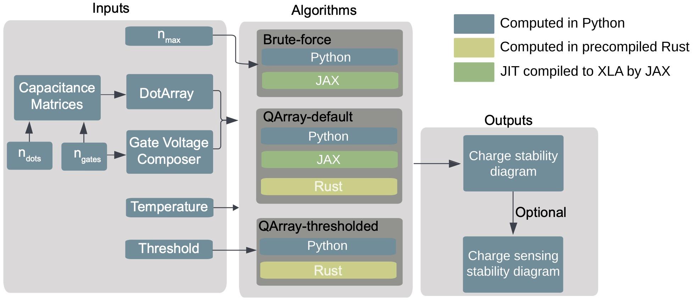
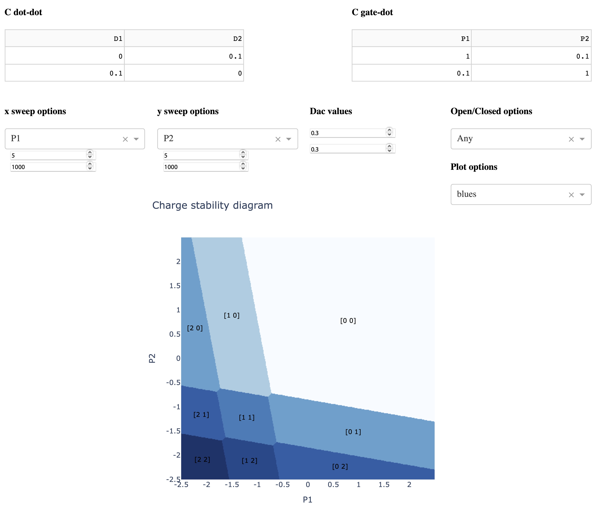

##############
Introduction
##############

|PyPI| |arXiv| |GitHub Workflow Status| |image1| |image2|

Documentation:`https://qarray.readthedocs.io/en/latest/introduction.html <https://qarray.readthedocs.io/en/latest/introduction.html>`__

Paper: `QArray: a GPU-accelerated constant capacitance model simulator for large quantum dot arrays; Barnaby van Straaten, Joseph Hickie, Lucas Schorling, Jonas Schuff, Federico Fedele, Natalia Ares; <https://arxiv.org/abs/2404.04994>`__

|capacitance_model|

**QArray** harnesses the speed of the systems programming language Rust
or the compute power of GPUs using JAX XLA to calculate charge stability diagrams via the constant
capacitance model in seconds or milliseconds.
It couples highly optimised and parallelised code with two new
algorithms to compute the ground state charge configuration of the simulated system. Our
algorithms scale better than the traditional brute-force approach and do
not require the user to specify the maximum number of charge carriers `a priori`. QArray can simulate the charge stability diagrams of quantum dot arrays in regimes where charges can tunnel between the dots and reservoirs (the open regime), as well as the case where the dots are isolated from the reservoirs (the closed regime).

QArray includes a graphical user interface (GUI) that allows users to interact with the simulation in real-time.

|GUI|

QArray runs on both CPUs and GPUs and is designed to be easy to use and
integrate into your existing workflow. It was developed on macOS running
on Apple Silicon and is continuously tested on Windows-lastest, macOs13,
macOS14 and Ubuntu-latest.

QArray captures physical effects including charge sensing measurements and the thermal broadening of charge transitions. The combination of these effects permits the simulation of
charge stability diagrams that are visually similar to those measured
experimentally.

The plots on the left below are measured
experimentally, and the plots on the right are simulated using QArray. Figure (a) shows the
charge stability diagram of an open quadruple quantum dot array recreated with permission
from `[1] <#%5B1%5D>`__ while (b) is a simulated using QArray. Figure (c) shows the charge
stability diagram of a closed five dot quantum recreated with permission from `[2] <#%5B2%5D>`__; (d) is our simulated recreation.

|recreations|

The code to reproduces these plots can be found in the examples folder of the QArray repository, named
figure_4b.py and figure_4d.py respectively.

.. |arXiv| image:: https://img.shields.io/badge/arXiv-2404.04994-Green.svg
.. |PyPI| image:: https://img.shields.io/pypi/v/qarray
.. |GitHub Workflow Status| image:: https://github.com/b-vanstraaten/qarray/actions/workflows/windows_tests.yaml//badge.svg
.. |image1| image:: https://github.com/b-vanstraaten/qarray/actions/workflows/macos_tests.yaml//badge.svg
.. |image2| image:: https://github.com/b-vanstraaten/qarray/actions/workflows/linux_tests.yaml//badge.svg
.. |recreations| image:: ./figures/recreations.png
    :width: 500

.. |capacitance_model| image:: ./figures/capacitance_model.png

References
----------

[1] `M. R. Delbecq, T. Nakajima, T. Otsuka, S. Amaha, J. D. Watson, M. J. Manfra, S. Tarucha; Full control of quadruple quantum dot circuit charge states in the single electron regime. Appl. Phys. Lett. 5 May 2014; 104 (18): 183111. https://doi.org/10.1063/1.4875909 <https://pubs.aip.org/aip/apl/article/104/18/183111/24127/Full-control-of-quadruple-quantum-dot-circuit>`__

[2] `Mortemousque, PA., Chanrion, E., Jadot, B. et al. Coherent control of individual electron spins in a two-dimensional quantum dot array. Nat. Nanotechnol. 16, 296–301 (2021). https://doi.org/10.1038/s41565-020-00816-w <https://www.nature.com/articles/s41565-020-00816-w>`__
